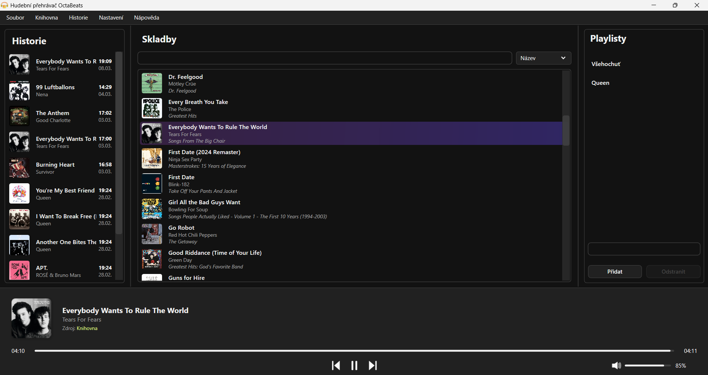
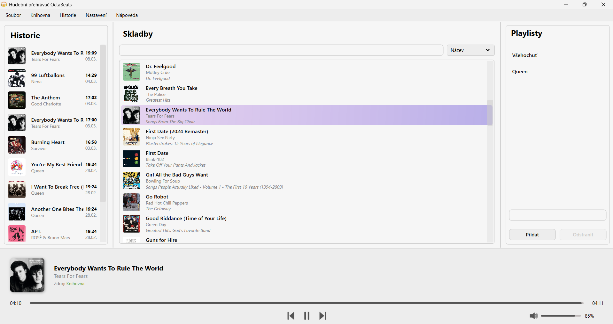

#  OctaBeats – Music Player

🌍 Language: [🇨🇿 Čeština](#cz) | [en English](#en)

---

## Česká verze

OctaBeats je desktopová aplikace pro přehrávání hudby. Aplikace umožňuje správu hudební knihovny, tvorbu playlistů a pohodlné přehrávání skladeb s důrazem na jednoduché a přehledné uživatelské rozhraní.

---

### 📸 Ukázka aplikace

Hlavní okno aplikace v tmavém a světlém režimu.

  
    
  

---

### ✨ Funkce

- 🎶 Přehrávání hudby (Play, Pause, Next, Previous)
- 📁 Přidávání jednotlivých skladeb i celých složek
- 🔍 Vyhledávání skladeb (název, interpret)
- 📜 Historie přehrávání
- 📂 Správa playlistů (vytváření, úprava, mazání)
- 📝 Editor playlistu s podporou multi-select
- ➕ Přidání celé složky do playlistu
- 🎧 Zobrazení metadat skladby
- 🖼️ Práce s přebalem alba
- 🌍 Lokalizace aplikace
- 🌙 Světlý a tmavý režim

---

### 🚀 Instalace

1. Stáhněte `.msi` soubor z Releases  
2. Spusťte instalační soubor  
3. Dokončete instalaci pomocí průvodce  

---

## English version

OctaBeats is a desktop music player application. The application allows users to manage a music library, create playlists, and play audio files with a focus on a clean and intuitive user interface.

---

### 📸 Screenshots

The main application window in both dark and light modes.

  
    
  

---

### ✨ Features

- 🎶 Music playback (Play, Pause, Next, Previous)
- 📁 Add individual songs or entire folders
- 🔍 Search songs (by title, artist)
- 📜 Playback history
- 📂 Playlist management (create, edit, delete)
- 📝 Playlist editor with multi-selection support
- ➕ Add entire folder to playlist
- 🎧 Song metadata display
- 🖼️ Album cover support
- 🌍 Localization (multi-language support)
- 🌙 Light / Dark mode

---

### 🚀 Installation

1. Download the `.msi` installer from Releases  
2. Run the installer  
3. Follow the installation wizard  
